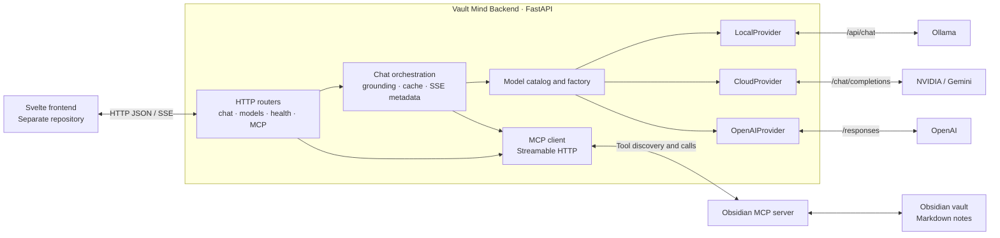

# Vault Mind Backend

Vault Mind Backend connects a chat interface to local or cloud language models and an Obsidian vault. It provides a single HTTP API for model selection, chat responses, vault tool access, and dependency diagnostics.

The backend owns provider credentials, model routing, vault retrieval, and model-to-tool orchestration. The separate Svelte frontend owns conversation display, Markdown rendering, model selection controls, and user interaction. Obsidian remains the source of knowledge: this service reads it through the Model Context Protocol (MCP), without maintaining a separate document database or search index.

This README describes the implementation in this repository. [ARCHITECTURE.md](ARCHITECTURE.md) is the original design proposal; some of its transport, streaming, configuration, and session-storage ideas have not been implemented.

## Contents

- [Capabilities and scope](#capabilities-and-scope)
- [System architecture](#system-architecture)
- [Repository layout](#repository-layout)
- [Request lifecycle](#request-lifecycle)
- [Vault retrieval design](#vault-retrieval-design)
- [Model providers and selection](#model-providers-and-selection)
- [MCP transport and permissions](#mcp-transport-and-permissions)
- [HTTP API and SSE contract](#http-api-and-sse-contract)
- [Configuration](#configuration)
- [Development setup](#development-setup)
- [Docker deployment](#docker-deployment)
- [Testing](#testing)
- [Observability and troubleshooting](#observability-and-troubleshooting)
- [Design choices and current limitations](#design-choices-and-current-limitations)
- [Related documentation](#related-documentation)

## Capabilities and scope

| Area | Current implementation |
| --- | --- |
| Chat API | `POST /api/chat`, returning JSON events over Server-Sent Events (SSE). |
| Local inference | Ollama-compatible HTTP API. |
| Cloud inference | NVIDIA and Gemini through chat completions; OpenAI through a separate Responses API adapter. |
| Model selection | Server-configured catalog and per-request `model_id` selection. |
| Vault grounding | Optional cloud-chat preflight that reads the vault index and a uniquely matched project's identity/current-state notes. |
| Model-directed tools | Four read-only Obsidian tools, executed by the backend with a bounded model-round budget. |
| Manual tools | HTTP proxy for MCP tool discovery and execution. |
| Presentation metadata | Optional source references and Markdown sections derived from tool results. |
| Diagnostics | Request IDs, structured error fields, elapsed times, retrieval counters, and provider-reported token usage. |
| Persistence | No backend chat database, stored sessions, vector database, or persistent retrieval cache. |

**Streaming behavior:** SSE carries tool progress and answer events, but each provider currently waits for the complete upstream answer and emits it as one `token` event. Incremental model-text streaming is not implemented.

**Deployment scope:** the application currently suits a trusted local environment. It has no application authentication or authorization, and its manual MCP proxy can call tools beyond the chat allowlist.

## System architecture



### Application boundaries

1. **HTTP boundary:** FastAPI validates chat requests with Pydantic and exposes JSON/SSE responses. CORS allows one configured frontend origin.
2. **Orchestration boundary:** the chat router prepares messages, retrieves vault context, executes allowed tools, caches successful results for that request, and assembles presentation metadata.
3. **Provider boundary:** adapters translate shared `Message` objects into provider-specific requests and return shared `Chunk` objects. Provider failures carry a stable error code and status.
4. **MCP boundary:** one client module handles connection setup, authentication, serialization, deadlines, and transport-error normalization for all MCP callers.
5. **Storage boundary:** knowledge remains in the external vault. This backend has no database writes, migrations, or durable conversation state.

All work runs in the request's asynchronous execution path. There is no message broker, background worker, job queue, or event bus. SSE events describe request progress to the client; they are not persisted events.

### Technology stack

| Technology | Role |
| --- | --- |
| Python | Application language; the Docker image uses Python 3.14. |
| FastAPI | HTTP routing, request validation integration, CORS, generated API documentation. |
| Uvicorn | ASGI application server. |
| Pydantic | `ChatRequest` validation, supplied through FastAPI's dependencies. |
| HTTPX | Asynchronous requests to model APIs and MCP transport. |
| MCP Python SDK, `>=1.27,<2` | MCP sessions and Streamable HTTP transport. |
| AnyIO | Complete-operation deadlines for MCP; supplied through the dependency graph. |
| Python standard library | Dataclass configuration, JSON, logging, context-local diagnostics, and `unittest`. |
| TypeScript | Reference frontend API client in `frontend/api.ts`. |
| Docker / Compose | Backend image and local runtime definition. |

The direct dependency list is [backend/requirements.txt](backend/requirements.txt). FastAPI, HTTPX, and Uvicorn are not version-pinned, and there is no dependency lockfile in the tracked project.

## Repository layout

```text
.
├── README.md                         # Current architecture and operating guide
├── ARCHITECTURE.md                   # Original architecture proposal
├── AGENTS.md                         # Contributor/agent memory instructions
├── Dockerfile                       # Python backend image and HTTP healthcheck
├── compose.yaml                     # Local host-network deployment
├── backend/
│   ├── .env.example                  # Example configuration; no real credentials
│   ├── requirements.txt
│   └── app/
│       ├── main.py                  # FastAPI app, logging, CORS, router registration
│       ├── api/
│       │   ├── chat.py              # Grounding, tool policy/cache, SSE orchestration
│       │   ├── health.py            # Default provider and MCP diagnostics
│       │   ├── models.py            # Frontend model catalog
│       │   └── mcp.py               # Manual MCP tool proxy
│       ├── core/
│       │   ├── config.py            # Frozen settings dataclass from environment
│       │   ├── diagnostics.py       # ContextVar counters, request IDs, usage logging
│       │   └── sse.py               # JSON SSE framing and error/done emission
│       ├── mcp/
│       │   └── client.py            # Shared MCP transport and error boundary
│       ├── models/
│       │   ├── base.py              # Message, Chunk, ProviderError, ModelProvider
│       │   ├── catalog.py           # Configured model IDs and selection precedence
│       │   ├── factory.py           # Provider adapter selection
│       │   ├── local_provider.py    # Ollama HTTP adapter
│       │   ├── cloud_provider.py    # NVIDIA/Gemini chat-completions adapter
│       │   └── openai_provider.py   # OpenAI Responses adapter
│       └── schemas/
│           └── chat.py              # ChatRequest schema
├── frontend/
│   └── api.ts                       # Reference HTTP/SSE client, not a Svelte app
├── docs/
│   ├── runtime-env.md               # Local runtime environment reference
│   ├── frontend-integration.md      # Frontend/backend integration contract
│   └── frontend-response-display.md # Rendering and stream-client implementation handoff
└── tests/
    ├── test_app.py                  # API, providers, tools, metadata, logging
    ├── test_retrieval.py            # Envelope decoding, routing, cache, diagnostics
    └── test_timeouts.py             # Dependency failures, deadlines, cancellation
```

## Request lifecycle

### Cloud chat with vault grounding enabled

**Trigger:** a valid `POST /api/chat` request resolves to a cloud provider and `CHAT_MCP_ENABLED=true`.

```mermaid
sequenceDiagram
    participant UI as Frontend
    participant API as Chat router
    participant MCP as Obsidian MCP
    participant Model as Model provider

    UI->>API: POST /api/chat {message, model_id}
    Note over API: Generate request ID and resolve configured model
    API->>MCP: vault_read 00-Index.md
    MCP-->>API: MCP result envelope
    Note over API: Decode note and match project aliases
    opt Exactly one project matches and context budget remains
        API->>MCP: vault_read project README.md
        MCP-->>API: Identity note
        API->>MCP: vault_read project state.md
        MCP-->>API: Current state note
    end
    API->>MCP: list_tools
    MCP-->>API: Tool schemas
    Note over API: Keep read-only allowlist; construct system context
    API->>Model: Grounded messages and function definitions
    loop While model requests tools, within round budget
        Model-->>API: Function calls
        API-->>UI: SSE tool_call
        API->>MCP: Allowed call, unless successful result is cached
        MCP-->>API: Tool result
        API-->>UI: SSE tool_result
        API->>Model: Results in provider-specific format
    end
    Model-->>API: Complete answer
    API-->>UI: SSE token
    API-->>UI: Optional sources and sections
    API-->>UI: SSE done
```

**Main path:** provider resolution happens inside the response generator. The router creates a cache and source collection for this chat, performs preflight reads, discovers tools, and constructs a system message containing the bounded vault context followed by the user's message. The adapter then handles model/tool rounds.

**Events:** model-requested tool calls emit `tool_call` before execution and `tool_result` after success, including cache hits. Preflight reads happen before provider generation and do not emit those tool-progress events. Their note references can appear in the final `sources` event.

**Statuses:** normal completion emits `done`; handled failures emit `error` followed by `done`. Cancellation is propagated and recorded as `cancelled` in summary logs. A disconnected client cannot be guaranteed a final event.

**Failure behavior:** grounding, discovery, and tool-execution failures stop the grounded request. The backend does not silently answer from generic model knowledge after a grounding failure. Presentation metadata is emitted after successful provider completion, so it is not guaranteed on failed requests.

**Database behavior:** there are no database operations. Messages, cache entries, source metadata, and diagnostics exist only for the lifetime of this request.

**Source modules:** [chat.py](backend/app/api/chat.py), [factory.py](backend/app/models/factory.py), the provider adapters, and [MCP client](backend/app/mcp/client.py).

### Local chat or cloud chat without grounding

The router sends only the current user message to the selected provider. It does not preload vault notes, discover tools, or create a chat tool runner. Local chat follows this path even when `CHAT_MCP_ENABLED=true`: local MCP grounding and tool calling are not implemented.

### Tool budget and finalization

`CHAT_MCP_MAX_ROUNDS` defaults to `3`. Each cloud adapter can make up to that many normal model requests. If the model continues requesting tools through the last allowed round, the adapter executes those calls and makes one additional request with no tool definitions, instructing the model to answer from the gathered results.

With the default configuration, that is up to **four model requests**: three regular rounds plus a finalization request. This setting limits model rounds, not individual tool calls; one model response may request several tools, which the backend executes sequentially. Preflight reads and tool discovery are outside that round count.

A finalization response that still requests tools or provides no usable answer produces `tool_round_limit` with status metadata `508`. There are no automatic retries or provider failovers.

## Vault retrieval design

### Expected note organization

Automatic project routing recognizes project README links in the root `00-Index.md`, under `01-Work` or `02-Personal`:

```text
00-Index.md
02-Personal/
└── example-project/
    ├── README.md
    ├── state.md
    ├── runbook.md
    ├── decisions.md
    ├── lifecycle.md
    └── lessons.md
```

An index entry can define both a project label and an alias:

```markdown
## Projects

- [[02-Personal/example-project/README.md|Example Project]]
  (alias: [[02-Personal/example-project/README.md|example-app]])
```

The automatic preflight needs `00-Index.md` and, for a matched project, its `README.md` and `state.md`. The other capsule notes are available for targeted model reads when relevant.

### Project matching

The matcher scans index wikilinks whose targets end in `README` or `README.md`. It recognizes the link label, capsule directory name, and that directory name with hyphens replaced by spaces. Matching is case-insensitive and uses boundaries that distinguish related names such as `vault-mind` and `vault-mind-backend`.

- **Exactly one matched project:** preload its README and sibling `state.md`, while budget remains.
- **No matched project:** preload the index; the model may search with targeted terms or ask for more information.
- **Multiple matched projects:** preload the index without choosing a project; the system message instructs the model to clarify ambiguity.

Dot-prefixed path components are excluded from automatic project-link matching. This is a routing rule, not a general path authorization policy for all MCP calls.

The preflight does not run a full-question search, scan the entire vault, compute embeddings, or rank vector matches. Project identity comes from explicit index links and current state comes from the capsule's `state.md`.

### Context limits

| Limit | Current value | Scope |
| --- | --- | --- |
| Preloaded files | At most 4 | `_build_vault_context`; the normal unique-project path reads up to 3 notes. |
| Preload size | 12,000 characters | Includes system instructions, headings, and note text. |
| Source excerpt | First 240 normalized characters, plus truncation marker when needed | Presentation metadata only. |
| Tool rounds | Configurable; default 3 | Normal cloud model requests before optional finalization. |

The 12,000-character cap applies to the constructed preload message. It does **not** cap the full MCP response fetched into memory or later model-directed tool results. Those results are serialized into subsequent provider requests without the same context limit.

The system message tells the model to treat retrieved notes as reference data, use the README for identity, use `state.md` for current truth, and avoid substituting generic product knowledge for a vault-defined project. These are model instructions; they do not replace backend tool permissions.

### MCP result normalization

Chat receives MCP envelopes and normalizes them before using their contents:

1. An envelope with `isError` becomes `mcp_tool_failed`.
2. Non-null `structuredContent` takes precedence.
3. Text blocks are decoded as JSON where possible; plain text is retained.
4. Multiple plain-text blocks are joined; multiple structured values remain a list.
5. Note content, search paths, and listing entries are extracted for grounding and presentation.

A required preflight read with no usable note text produces `mcp_bad_response`. Successful transport alone does not count as successful grounding.

### Request-scoped cache

The cache key is the tool name plus JSON arguments serialized with sorted keys. Reordering argument keys does not cause another execution. Only successful decoded results are cached, and the cache is shared between preflight and model-requested calls within the same chat.

The cache is discarded when the request ends. It provides no cross-request reuse, invalidation mechanism, or durable state. Source references are deduplicated by vault-relative path; folder listings become Markdown sections.

## Model providers and selection

### Shared interface

[base.py](backend/app/models/base.py) defines:

- `Message(role, content)`: input messages independent of the upstream API.
- `Chunk(type, content)`: answer or tool-progress events returned by an adapter.
- `ProviderError(message, code, status_code)`: a typed failure that the chat layer can serialize.
- `ModelProvider`: a protocol exposing asynchronous `generate(...)` and `health()` methods.

| Adapter | Catalog prefix | Upstream request | Tool-result representation |
| --- | --- | --- | --- |
| `LocalProvider` | `local:` | `POST {LOCAL_MODEL_ENDPOINT}/api/chat` | No tool loop. |
| `CloudProvider` | `nvidia:`, `gemini:` | `POST {provider base URL}/chat/completions` | `role: tool` messages containing `tool_call_id`, `name`, and JSON-string content. |
| `OpenAIProvider` | `openai:` | `POST {OPENAI_BASE_URL}/responses` | `function_call_output` items paired by `call_id`; previous response output is retained in the next input. |

NVIDIA and Gemini share the chat-completions adapter because they use the same request pattern here. OpenAI has a separate adapter because its input, tool definitions, and output items have a different shape. All adapters use HTTPX; there is no provider-specific client SDK dependency.

Cloud requests use an output budget of `8192` (`max_tokens` for chat completions and `max_output_tokens` for Responses). The shared NVIDIA/Gemini adapter also sends `temperature=1.0` and `top_p=0.95`. These are implementation constants, not environment settings.

### Selection precedence

The catalog is built from configured comma-separated model lists. Requests resolve in this order:

1. Explicit `model_id`, such as `local:llama3`, if supplied.
2. Explicit `provider: "local"` or `provider: "cloud"`, using that category's configured default model. `cloud` uses `CLOUD_PROVIDER` to select the vendor.
3. `DEFAULT_MODEL_ID`, if configured.
4. The default derived from `MODEL_PROVIDER` and the applicable vendor/model settings.

An explicit `model_id` takes precedence over an accompanying `provider`. The request's `provider` field accepts only `local` and `cloud`; vendor names belong in the `model_id` prefix.

Unknown IDs produce `model_not_allowed`. There is no automatic selection of another model if the selected one fails. Keep default model names in their corresponding configured model lists: defaults are not automatically added to a nonempty custom list.

### Availability semantics

`GET /api/models` marks local catalog rows as available without probing Ollama. Cloud rows are marked available when the corresponding API-key setting is nonempty. This does not verify credential validity, model access, account quota, or provider reachability.

Likewise, cloud `health()` reports configuration presence rather than making an inference request. Local `health()` requests Ollama's `/api/tags`, but does not verify that the selected model is installed.

## MCP transport and permissions

### Connection lifecycle

The backend uses the MCP SDK's **Streamable HTTP** client against `MCP_SERVER_URL`. Each `list_tools` or `call_tool` operation creates a transport, initializes a `ClientSession`, performs the operation, and closes the session. There is no startup connection, persistent shared session, or cached tool registry.

When configured, `MCP_API_KEY` is sent as a bearer authorization header. `MCP_VERIFY_SSL` controls certificate verification. The MCP HTTP client disables environment-derived proxy settings with `trust_env=False`.

`MCP_SERVER_COMMAND` remains a configuration field but is unused; stdio/subprocess transport is not implemented.

### Chat permissions versus manual API

Cloud chat can discover and execute only:

| Tool | Purpose |
| --- | --- |
| `search_simple` | Search vault text. |
| `search_query` | Search using a structured query. |
| `vault_read` | Read a note or supported target within a note. |
| `vault_list` | List a vault directory. |

The allowlist is enforced both when exposing schemas and when executing model-requested tools. A disallowed name produces `mcp_tool_not_allowed` with status metadata `403`.

The manual `POST /api/mcp/tools/{tool_name}` endpoint forwards the specified tool to the MCP server without applying this chat allowlist. It can invoke write, delete, move, or command tools if the connected server exposes them. The application does not add a user-confirmation or authorization layer to that endpoint.

### Deadlines and error normalization

| Operation | Timeout configuration |
| --- | --- |
| Complete MCP operation | 30-second AnyIO deadline around transport/session setup, execution, and cleanup. |
| MCP transport | SDK timeout of 10 seconds and SSE read timeout of 30 seconds. |
| NVIDIA / Gemini / OpenAI request | HTTPX timeout of 120 seconds, with 10 seconds for connection establishment. |
| Local generation | HTTPX timeout of 60 seconds. |
| Local health probe | HTTPX timeout of 2 seconds, with 0.2 seconds for connection establishment. |

HTTPX timeouts apply to request phases; they are not an end-to-end chat deadline. Several model rounds and MCP calls can make total chat duration longer than a single timeout value.

The shared MCP session boundary inspects nested exception groups and maps timeout causes to `mcp_timeout` (`504`), and other connection/session failures to `mcp_unavailable` (`502`). Missing MCP URL configuration uses `503`. Cancellation is preserved. No retries are performed.

## HTTP API and SSE contract

The default server port is `8000`. FastAPI also supplies interactive documentation at `/docs`, alternative documentation at `/redoc`, and the schema at `/openapi.json`.

| Method | Path | Response |
| --- | --- | --- |
| `POST` | `/api/chat` | `text/event-stream`; generated `X-Request-ID` header. |
| `GET` | `/api/models` | Configured model catalog and default metadata. |
| `GET` | `/api/health` | Default provider and MCP status details. |
| `GET` | `/api/mcp/tools` | `{"tools": [...]}` from MCP discovery. |
| `POST` | `/api/mcp/tools/{tool_name}` | Raw MCP tool-result envelope. |

### Chat request

```json
{
  "message": "What is the current status of example-project?",
  "model_id": "openai:gpt-5.4-mini",
  "session_id": "optional-client-label"
}
```

The model ID above illustrates a value in the repository's default catalog; use `/api/models` for the configured choices in your deployment.

| Field | Required | Meaning |
| --- | --- | --- |
| `message` | Yes | String with a minimum length of one character. There is no configured upper bound or whitespace-only rejection. |
| `model_id` | No | Exact server-approved catalog ID. |
| `provider` | No | `cloud` or `local`; compatibility option for category-level selection. |
| `session_id` | No | Accepted as a string, but not used to retrieve or store conversation history. Only its presence is logged. |

Requests carry one user message. Passing the same `session_id` does not create multi-turn memory. Invalid request schemas are rejected by FastAPI before streaming, normally with HTTP `422`.

Example using the configured default:

```bash
curl -N -sS http://127.0.0.1:8000/api/chat \
  -H 'Content-Type: application/json' \
  -d '{"message":"What is the current status of example-project?"}'
```

### SSE event format

Each event is one `data:` line containing JSON, followed by a blank line. Event type is a JSON field; the backend does not use named SSE `event:` fields.

```text
data: {"type":"tool_call","content":"search_simple"}

data: {"type":"tool_result","content":"search_simple"}

data: {"type":"token","content":"The project is ready for its next review."}

data: {"type":"sources","sources":[{"title":"state.md","path":"02-Personal/example-project/state.md","excerpt":"Ready for review.","tool":"vault_read"}]}

data: {"type":"sections","sections":[{"title":"Vault Listing","content":"- `00-Index.md`"}]}

data: {"type":"done"}

```

This is an illustrative stream: `sources`, `sections`, and tool events appear only when the corresponding work produces them.

| Event | Payload | Frontend responsibility |
| --- | --- | --- |
| `token` | `content: string` | Append content without rewriting Markdown or adding artificial typing delays. |
| `tool_call` | `content: string` containing the tool name | Show tool progress if desired. Arguments are not included. |
| `tool_result` | `content: string` containing the tool name | Mark tool completion. The raw tool result is not included. |
| `sources` | `sources: [{title, path, excerpt?, tool?}]` | Render source references from metadata. |
| `sections` | `sections: [{title, content}]` | Render supplemental Markdown, such as folder listings. |
| `error` | `message`, `code`, `status_code` | Preserve failed state and display an actionable message. |
| `done` | No additional fields | End loading without clearing an earlier failure. |

`done` does not currently carry token usage. Source entries describe retrieved material, not a verified mapping from every answer claim to a citation.

The backend exposes `X-Request-ID` through CORS so a fetch-based client can correlate a response with logs. Because chat uses POST, the reference client reads the response body with `fetch` and `ReadableStream`.

### Errors

Handled generation failures use this sequence:

```text
data: {"type":"error","message":"Obsidian request timed out. Please try again.","code":"mcp_timeout","status_code":504}

data: {"type":"done"}

```

The HTTP status is normally already `200` once the stream starts. Clients must inspect events rather than relying solely on `response.ok`.

| Error code | Status metadata | Meaning |
| --- | --- | --- |
| `model_not_allowed` | 400 | Requested/default model ID is absent from the configured catalog. |
| `bad_request` | 400 | A `ValueError` reached the chat boundary. |
| `missing_api_key` | 503 | Selected cloud provider has no key configured. |
| `provider_bad_request` | 400 | Cloud upstream rejected the request. |
| `provider_payload_too_large` | 413 | Cloud upstream rejected the payload size. |
| `rate_limited` | 429 | Cloud upstream rate limit. |
| `provider_timeout` | 504 | AI timeout, including upstream HTTP 408/504. |
| `provider_http_error` | 502 | Transport failure; also non-timeout HTTP failures from the local adapter. |
| `provider_http_status` | Upstream status | Other HTTP failures from cloud adapters. |
| `provider_bad_response` | 502 | Cloud response or function-call data could not be interpreted. |
| `mcp_timeout` | 504 | MCP deadline or upstream timeout. |
| `mcp_unavailable` | 502 or 503 | MCP connection/session failure or missing configuration. |
| `mcp_tool_not_allowed` | 403 | Tool is outside the chat allowlist. |
| `mcp_tool_failed` | 502 | MCP result envelope reports `isError`. |
| `mcp_bad_response` | 502 | Preflight note has no usable text. |
| `tool_round_limit` | 508 | Finalization still requests tools or produces no usable answer. |

The error-then-done contract covers handled `ProviderError` and `ValueError` paths. Unexpected exceptions or disconnected transports can terminate a stream without `done`; clients also need network/EOF error handling. Local malformed-response handling is less comprehensive than the cloud adapters' handling.

### Model catalog

```bash
curl -sS http://127.0.0.1:8000/api/models
```

The response contains:

- `default`: configured category, `local` or `cloud`.
- `default_model_id`: resolved configured default ID.
- `models`: rows with `id`, vendor/category `provider`, `model`, `available`, and `default`.
- `providers`: compatibility metadata for the configured local and cloud defaults.

Use `models` to build a selector. Category metadata can differ from a `DEFAULT_MODEL_ID` override, so use the resolved model ID to identify the actual default.

### Health

```bash
curl -sS http://127.0.0.1:8000/api/health
```

The response includes `ok`, `provider`, `model_id`, `provider_status`, and `mcp`. When the handler returns normally, top-level `ok` is always `true`; it does not aggregate dependency failures. Inspect `provider_status.ok` and `mcp.ok` separately.

Configured MCP health actively lists tools. Without an MCP URL, `mcp.ok` is `not MCP_REQUIRED`. The health handler performs provider and MCP checks sequentially. A bad default model ID can prevent it from returning its normal response.

### Manual MCP calls

```bash
curl -sS http://127.0.0.1:8000/api/mcp/tools

curl -sS http://127.0.0.1:8000/api/mcp/tools/search_simple \
  -H 'Content-Type: application/json' \
  -d '{"query":"example-project","contextLength":80}'
```

The POST body is the tool's argument object, not an `arguments` wrapper. Use discovery to obtain the connected server's schemas. Unlike chat normalization, successful manual responses retain raw MCP envelopes, including any tool-level `isError` field.

Typed MCP transport failures use actual HTTP error statuses and a JSON response such as:

```json
{
  "detail": {
    "message": "Obsidian request timed out. Please try again.",
    "code": "mcp_timeout",
    "status_code": 504
  }
}
```

## Configuration

Settings are read from the process environment into a frozen dataclass when the application imports [config.py](backend/app/core/config.py). There is no automatic `.env` loading in application code and no runtime reload of settings. Restart the process or recreate the container after changing configuration.

The tables below show **source-code defaults**, not values from a running deployment. Model names are configurable repository defaults, not a guarantee of current provider/account availability.

### Application and model routing

| Variable | Code default | Purpose |
| --- | --- | --- |
| `MODEL_PROVIDER` | `local` | Default category: `local` or `cloud`. |
| `CLOUD_PROVIDER` | `nvidia` | Cloud default: `nvidia`, `gemini`, or `openai`. |
| `DEFAULT_MODEL_ID` | Empty | Optional default catalog ID override. |
| `FRONTEND_ORIGIN` | `http://localhost:5173` | Single permitted CORS origin. |
| `LOCAL_MODEL_ENDPOINT` | `http://127.0.0.1:11434` | Ollama endpoint. |
| `LOCAL_MODEL_NAME` | `llama3` | Default local model. |
| `LOCAL_MODELS` | Empty | Comma-separated local catalog; empty falls back to `LOCAL_MODEL_NAME`. |

### Cloud providers

| Variable | Code default | Purpose |
| --- | --- | --- |
| `NVIDIA_API_KEY` | Empty | Server-side NVIDIA credential. |
| `NVIDIA_BASE_URL` | `https://integrate.api.nvidia.com/v1` | NVIDIA API base. |
| `CLOUD_MODEL` | `minimaxai/minimax-m3` | Default NVIDIA model. |
| `NVIDIA_MODELS` | Empty | NVIDIA catalog; falls back to `CLOUD_MODEL`. |
| `GEMINI_API_KEY` | Empty | Server-side Gemini credential. |
| `GEMINI_BASE_URL` | `https://generativelanguage.googleapis.com/v1beta/openai` | Gemini compatibility API base. |
| `GEMINI_MODEL` | `gemini-3.5-flash` | Default Gemini model. |
| `GEMINI_MODELS` | Empty | Gemini catalog; falls back to `GEMINI_MODEL`. |
| `OPENAI_API_KEY` | Empty | Server-side OpenAI credential. |
| `OPENAI_BASE_URL` | `https://api.openai.com/v1` | OpenAI API base. |
| `OPENAI_MODEL` | `gpt-5.4-mini` | Default OpenAI model. |
| `OPENAI_MODELS` | `gpt-5.4-mini` | OpenAI catalog; an explicitly empty value falls back to `OPENAI_MODEL`. |

Changing `OPENAI_MODEL` alone does not replace the nonempty default `OPENAI_MODELS` list. Set both when selecting a different default model. Configure credentials only for the providers you intend to use.

### MCP and diagnostics

| Variable | Code default | Purpose |
| --- | --- | --- |
| `MCP_SERVER_URL` | Empty | MCP Streamable HTTP endpoint. |
| `MCP_API_KEY` | Empty | Optional bearer credential for MCP. |
| `MCP_VERIFY_SSL` | `false` | MCP TLS certificate verification. |
| `MCP_REQUIRED` | `false` | Controls whether absent MCP configuration reports healthy in MCP status. |
| `CHAT_MCP_ENABLED` | `false` | Enables cloud-chat grounding and read-only tool calls. |
| `CHAT_MCP_MAX_ROUNDS` | `3` | Normal model-round budget; must be at least 1. |
| `MCP_SERVER_COMMAND` | Empty | Reserved/unused; does not launch a subprocess. |
| `LOG_LEVEL` | `INFO` | Application logging level. |
| `LOG_PAYLOADS` | `false` | Enables request/response payload previews in normal diagnostic paths. |
| `LOG_PAYLOAD_CHARS` | `1000` | Payload-preview length limit. |

Boolean settings recognize `1`, `true`, `yes`, and `on`, case-insensitively. Other values evaluate to false. Invalid provider names and tool-round counts below one fail settings construction; malformed integer settings can also prevent startup.

**MCP flag behavior matters:** `MCP_REQUIRED=true` does not enforce startup readiness or enable grounding on its own. Grounding is controlled by `CHAT_MCP_ENABLED` and the selected provider category. When grounding runs, MCP failures stop the chat even if `MCP_REQUIRED=false`.

The tracked [backend/.env.example](backend/.env.example) differs from bare code defaults: it includes a local MCP endpoint and enables both MCP flags. Copying it assumes Obsidian MCP will be configured, though its model category remains local until changed.

## Development setup

### Prerequisites

- Python 3.14 to match the container runtime, or Docker for the packaged environment.
- Ollama with the configured model installed for local inference.
- A configured provider credential for cloud inference.
- A running Obsidian MCP server and suitable vault notes for grounded cloud chat or manual vault tools.

The frontend is developed and run separately. There is no `package.json` or Svelte development server in this backend repository.

### Install and run locally

From the repository root:

```bash
python3 -m venv .venv
.venv/bin/python -m pip install -r backend/requirements.txt
```

For local model chat without vault integration, run with explicit environment settings:

```bash
MODEL_PROVIDER=local \
DEFAULT_MODEL_ID=local:llama3 \
LOCAL_MODEL_NAME=llama3 \
LOCAL_MODELS=llama3 \
CHAT_MCP_ENABLED=false \
MCP_REQUIRED=false \
MCP_SERVER_URL= \
.venv/bin/python -m uvicorn app.main:app \
  --app-dir backend --host 127.0.0.1 --port 8000 --reload
```

Ollama must already be serving the selected model. Its installation and model download are outside this backend's setup.

For an environment file, the repository's local convention is to keep it outside the checkout:

```bash
mkdir -p "$HOME/.config/vault-mind-backend"
cp -n backend/.env.example "$HOME/.config/vault-mind-backend/runtime.env"
chmod 600 "$HOME/.config/vault-mind-backend/runtime.env"
```

Edit that file to supply the provider and MCP configuration you actually use. `cp -n` preserves an existing file. Load a trusted, shell-compatible environment file before starting Uvicorn:

```bash
set -a
. "$HOME/.config/vault-mind-backend/runtime.env"
set +a
.venv/bin/python -m uvicorn app.main:app \
  --app-dir backend --host 127.0.0.1 --port 8000 --reload
```

Keep real credentials out of the repository, screenshots, and frontend environment variables. The backend sends retrieved vault context and subsequent tool results to the selected cloud provider when grounded cloud chat runs.

### Frontend integration

[frontend/api.ts](frontend/api.ts) is a reference helper exposing `getHealth`, `getModels`, `getMcpTools`, `callMcpTool`, and `streamChat`. Its base URL comes from `VITE_API_BASE_URL`, falling back to `http://127.0.0.1:8000`.

Set the backend's `FRONTEND_ORIGIN` to the browser application's exact origin. `localhost` and `127.0.0.1` are different origins. Provider and MCP credentials belong only in the backend environment.

The helper implements the backend's simple current SSE framing. It is not a complete general-purpose SSE parser and does not expose cancellation or request-ID callbacks. Consult the [response-display handoff](docs/frontend-response-display.md) when implementing robust parsing, cancellation, safe Markdown, and source links in the real frontend; it describes pending changes, not capabilities already present in this helper.

## Docker deployment

### Image design

The [Dockerfile](Dockerfile):

1. Starts from `python:3.14-slim`.
2. Installs `backend/requirements.txt`.
3. Copies only `backend/app` into `/app/app`.
4. Disables Python bytecode writes and enables unbuffered output.
5. Runs `uvicorn app.main:app --host 0.0.0.0 --port 8000`.
6. Adds an HTTP healthcheck every 30 seconds, with a 3-second Docker timeout and three retries.

The image does not include tests, the frontend application, or the Obsidian vault. Runtime configuration is supplied separately.

### Compose runtime

[compose.yaml](compose.yaml) defines one backend service:

| Setting | Value |
| --- | --- |
| Image | `vault-mind-backend:local` |
| Container | `vault-mind-backend-local` |
| Network | `host` |
| Environment file | `/home/yung/.config/vault-mind-backend/runtime.env` |

The checked-in environment path is specific to the original workstation. Change that `env_file` path for another user or machine. The host-network design lets the backend reach loopback services such as Ollama and the Obsidian MCP server on the local Linux host. It has no published-port mapping or persistent volume.

Build and start:

```bash
docker compose up -d --build --force-recreate
```

Use recreation after environment-file changes so the process receives updated settings. Inspect or stop it with:

```bash
docker compose ps
docker logs -f vault-mind-backend-local
docker compose down
```

For an image build without starting Compose:

```bash
docker build -t vault-mind-backend:local .
```

The Uvicorn command binds all interfaces, and host networking uses the host's network directly. CORS controls browser cross-origin access; it is not authentication and does not restrict direct HTTP clients. A deployment exposed beyond a trusted local environment needs an access-control boundary, particularly around the unrestricted manual MCP proxy.

The Docker healthcheck tests whether `/api/health` returns successfully; it does not inspect nested dependency status. Conversely, a slow MCP probe can exceed the healthcheck's two-second HTTP client timeout even though the chat MCP operation deadline is longer.

### Packaging and release scope

The Docker image is the current packaging mechanism. The repository does not define a versioned Python package, migration process, or registry-publishing command. Compose's `:local` tag is a local build tag, not a versioned release identifier. Dependency versions and deployment readiness should be verified for any release beyond the current local workflow.

## Testing

Tests use standard-library `unittest`, asynchronous test cases, mocked provider/MCP boundaries, and HTTPX's ASGI transport. No separate test framework is required.

| File | Coverage |
| --- | --- |
| [test_app.py](tests/test_app.py) | SSE framing, model selection, credentials, cloud payload/response handling, tool loops and finalization, read-only policy, presentation metadata, logging, MCP status. |
| [test_retrieval.py](tests/test_retrieval.py) | Realistic MCP envelopes, project aliases and ambiguity, context caps, source extraction, cache reuse/isolation, request-ID isolation, usage reporting. |
| [test_timeouts.py](tests/test_timeouts.py) | Nested SDK failures, complete-operation deadlines, cancellation, AI timeouts, manual endpoint status codes, error-then-done behavior through the HTTP API. |

With local dependencies installed:

```bash
PYTHONPATH=backend .venv/bin/python -m unittest discover -s tests -q
```

Using an existing Docker image, run the current checkout's source and tests with read-only mounts and no network:

```bash
docker run --rm --network none \
  -v "$PWD/backend/app:/app/app:ro" \
  -v "$PWD/tests:/tests:ro" \
  vault-mind-backend:local \
  python -m unittest discover -s /tests -q
```

**Latest verification for this README: 2026-09-17 — all 46 tests passed using the existing Docker image with the current source and tests mounted, with networking disabled.** This verifies application behavior under mocks; it does not validate live model credentials, provider model access, deployed frontend rendering, or real MCP connectivity. The documentation update did not rebuild or restart the running service.

## Observability and troubleshooting

### Request correlation

Each chat receives a generated UUID-based request ID in `X-Request-ID`. A `ContextVar` keeps its counters isolated from concurrent chats, and a logging filter inserts the ID into timestamped records. Logs outside a chat use `request_id=-`.

The final `chat_complete` record reports:

| Field | Meaning |
| --- | --- |
| `status` | `completed`, `error`, or `cancelled`. |
| `elapsed_ms` | Total measured chat duration. |
| `tool_executions` | Actual attempted tool executions; excludes cache hits and discovery. |
| `cache_hits` | Successful results reused within the request. |
| `ai_rounds` | Model HTTP requests, including finalization. |
| `notes_extracted` | Nonempty note-text extractions from executed `vault_read` calls. |
| `context_chars` | Constructed preload system-message size. |

`provider_usage` records upstream-reported input/output token counts per model response. Missing counts are logged as `unavailable`; the backend does not estimate cost or tokens from JSON length. Diagnostic fields named `request_bytes`, `args_bytes`, and `result_bytes` currently measure serialized JSON string length, not encoded wire-byte counts.

### Useful log events

- `chat_start`, `chat_complete`, `chat_error`.
- `chat_mcp_grounding_start`, `chat_mcp_grounding_complete`.
- `chat_mcp_tools_loaded`, `chat_mcp_cache_hit`.
- `cloud_provider_tool_call_requested`.
- `chat_mcp_tool_request`, `chat_mcp_tool_response`.
- `cloud_provider_request`, `cloud_provider_response`, `provider_usage`.
- `mcp_request_failed`, `local_provider_request_failed`, `cloud_provider_timeout`, `cloud_provider_http_error`.

Normal diagnostics emphasize names, counts, timing, and sizes. `LOG_PAYLOADS=true` enables truncated previews with dictionary-key-based redaction. Cloud HTTP-error paths also log a truncated upstream response body even when normal payload previews are disabled. Redaction is not a guarantee that arbitrary text is free of prompt content or secrets; handle debug/error logs accordingly.

### Common symptoms

| Symptom | What to inspect |
| --- | --- |
| Model selector shows a cloud model unavailable | Check that the matching key setting is nonempty in the backend process, then recreate the container after changes. |
| Catalog says available but chat fails | Availability is configuration metadata; inspect the provider error for credentials, quota, model access, or upstream failure. |
| `model_not_allowed` | Compare the requested/default ID with `/api/models`; keep the chosen default in its catalog list. |
| Chat ignores vault knowledge | Confirm a cloud model is selected and `CHAT_MCP_ENABLED=true`. Local chat does not use MCP. |
| Generic or ambiguous project answer | Inspect explicit index aliases and `project_matches` in grounding logs; ensure project README/state notes identify the project clearly. |
| `mcp_bad_response` | A required preflight note yielded no usable text; check its path and the connected MCP server's result shape. |
| `mcp_unavailable` / `mcp_timeout` | Check Obsidian, its MCP server URL, authorization, certificate settings, and connection/deadline logs. |
| Long wait before answer text | Preflight and model/tool rounds precede the buffered answer; use request timings and `ai_rounds` to locate the delay. |
| Failure disappears in the frontend | Ensure `done` ends loading without resetting state established by `error`. |
| Health says `ok: true` despite a failed dependency | Inspect nested `provider_status.ok` and `mcp.ok`. |
| Browser CORS failure | Match the exact frontend origin, including scheme, hostname, and port. |

## Design choices and current limitations

### Why these boundaries exist

- **One backend API:** the frontend uses one model-selection and event contract while credentials and vendor-specific request formats stay server-side.
- **Explicit provider adapters:** the shared protocol keeps orchestration stable, while separate Responses handling preserves the provider's native tool-call representation.
- **Vault-first project grounding:** index links provide project identity, and README/state notes prioritize current context before historical exploration.
- **Request-local caching:** repeated successful reads within one answer avoid repeated MCP operations without a long-lived invalidation problem.
- **Backend-owned tool execution:** models propose calls; the backend enforces chat permissions and runs them through the shared transport boundary.
- **SSE for response events:** one POST produces ordered progress and answer events without a WebSocket service.
- **Backend metadata, frontend rendering:** normalized sources and sections prevent the UI from having to infer note paths from answer text or decode raw MCP envelopes.
- **No silent fallback:** a dependency failure remains visible; the backend does not change providers, spend on a different service, or discard grounding requirements automatically.

### Current boundaries to account for

- Chat history and `session_id` persistence are absent; each request starts from the current message.
- Local models do not participate in vault grounding or MCP tool loops.
- All model adapters buffer upstream answers; there are no incremental model deltas, heartbeat events, resumable event IDs, or stream replay.
- Model-round limits do not cap the number of tools per round or the size of later tool results.
- Automatic retrieval understands explicit index aliases rather than fuzzy semantic similarity.
- MCP sessions and tool discovery are recreated for each operation/request; there is no pooled session manager.
- `MCP_REQUIRED` is a health-status option, not a startup gate or universal grounding requirement.
- Health/catalog metadata does not establish end-to-end readiness.
- Manual MCP tools have broader permissions than chat, and there is no per-user authentication, authorization, or rate limiting.
- TLS verification for MCP defaults to off to accommodate the local configuration; enable it when the MCP endpoint has a trusted certificate.
- Dependencies are not fully pinned, and broader Python/platform compatibility is not documented by a test matrix.
- The frontend display handoff includes work that remains separate from this backend's implemented behavior.

### Extending the project

For a new model vendor, update configuration, catalog construction, factory routing, and an appropriate adapter, then verify selection, errors, and tool finalization with the existing test style. Keep vendor wire formats inside the adapter and preserve the shared SSE event contract.

For a new chat tool, review both schema exposure and execution policy in `api/chat.py`, its result normalization/presentation needs, and corresponding tests. Enabling a mutating tool requires an explicit authorization design; adding it to the allowlist alone does not create one.

For a new project in the vault, add an explicit index link and maintain its README/state notes. This changes the project's retrievable identity without requiring a backend code change.

## Related documentation

- [Original architecture proposal](ARCHITECTURE.md) — initial requirements and proposed milestones; this README takes precedence for descriptions of current behavior.
- [Runtime environment](docs/runtime-env.md) — workstation runtime configuration reference.
- [Frontend integration](docs/frontend-integration.md) — API helper usage and event handling.
- [Frontend response display](docs/frontend-response-display.md) — detailed implementation handoff for Markdown, source references, cancellation, and robust SSE parsing.
- [Agent instructions](AGENTS.md) — project memory and contributor workflow.

### Project memory capsule

These full-path Obsidian links address the project's durable notes in the `AI-Memory-Storage` vault. They are Obsidian references, not files shipped in this Git repository:

- [[02-Personal/vault-mind-backend/README.md|Project capsule]]
- [[02-Personal/vault-mind-backend/state.md|Current state]]
- [[02-Personal/vault-mind-backend/runbook.md|Verified commands]]
- [[02-Personal/vault-mind-backend/decisions.md|Decisions]]
- [[02-Personal/vault-mind-backend/lifecycle.md|Lifecycle]]
- [[02-Personal/vault-mind-backend/lessons.md|Lessons]]
